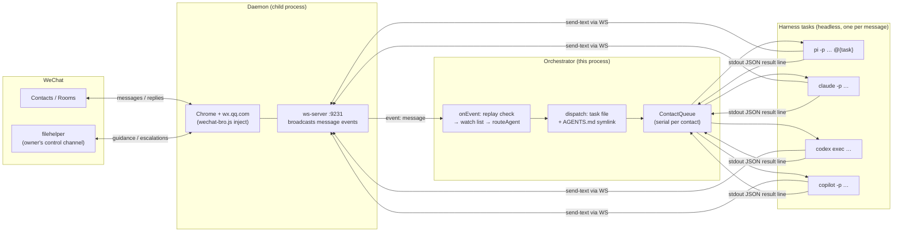
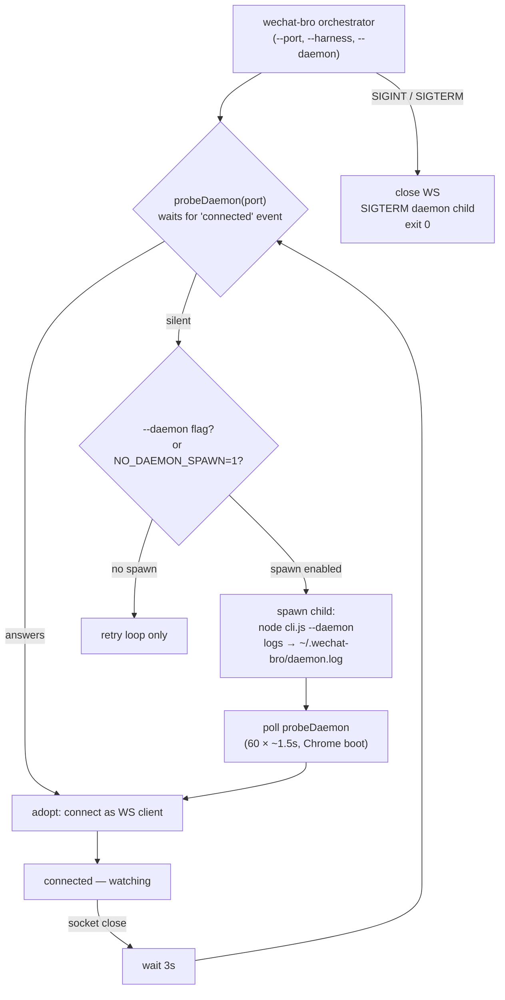
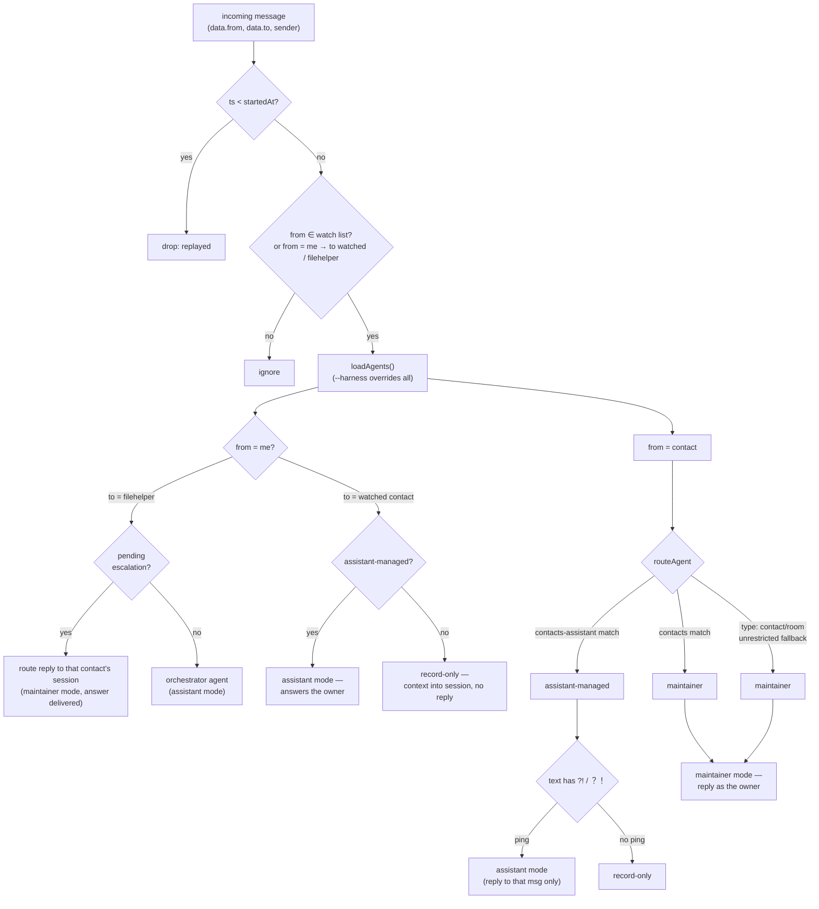
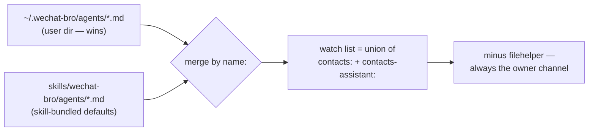
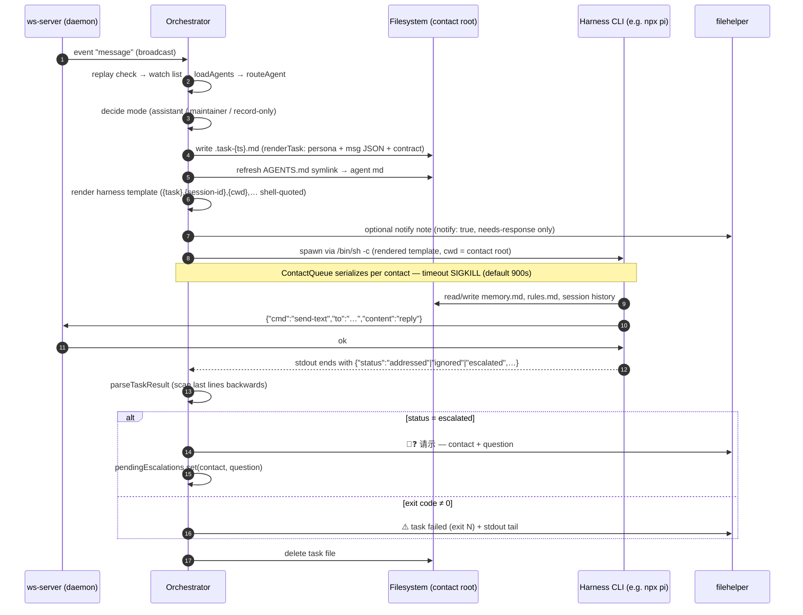
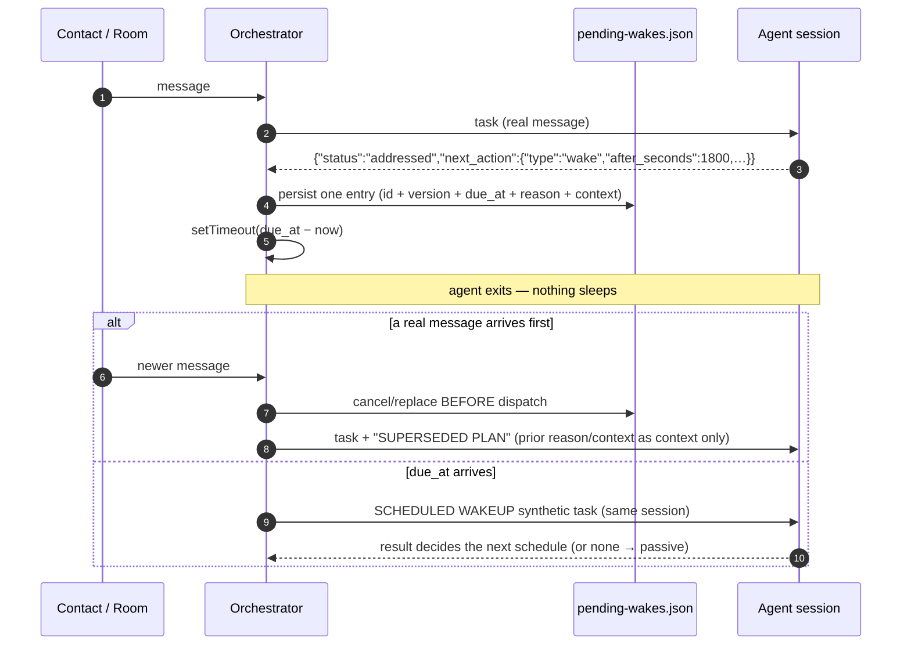
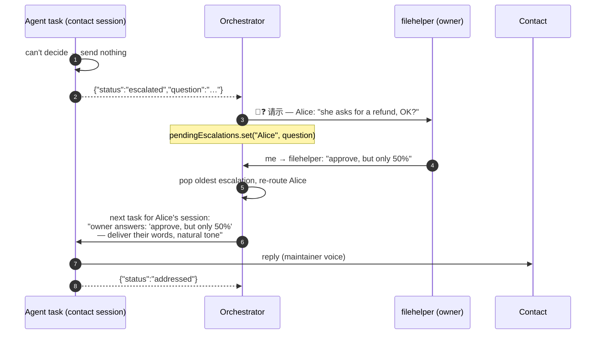

# The wechat-bro Orchestrator

How `wechat-bro orchestrator` turns incoming WeChat messages into resumable
agent tasks — and their replies back into WeChat messages.

Source: `src/orchestrator.js` (entry via `src/cli.js`, first positional arg
`orchestrator`). Full frontmatter/harness reference:
[`skills/wechat-bro/SKILL.md`](../skills/wechat-bro/SKILL.md).

---

## 1. Big picture

The orchestrator is a **file-driven agent dispatcher**. It is a plain
WebSocket *client* of the wechat-bro daemon (the Chrome process logged into
wx.qq.com). It watches the contacts declared in agent `*.md` frontmatter and,
for every incoming message, renders a task file and runs a headless harness
CLI (pi by default) rooted in the contact's own folder. The account owner
talks to it through **filehelper** (文件传输助手).



Key invariants:

- **One harness invocation per message batch** — the session is *resumed* via
  the harness's own session flags, not held in memory.
- **Per-contact serialization** — a contact's task never runs concurrently
  with itself (`ContactQueue`).
- **No long argv** — the message goes into a task file (`@{task}` /
  `$(cat {task})`); the agent persona is a **symlinked `AGENTS.md`**, never an
  argument (EDR kills >1KB command lines).
- **The orchestrator owns continuation** — a worker may *request* a future
  self-wakeup (`next_action`), but only the orchestrator creates timers,
  enforces delay bounds, persists them, and can cancel/replace them.

---

## 2. Daemon lifecycle

The orchestrator owns its daemon: it adopts one already listening, otherwise
spawns one **as a child process** that lives and dies with it.



- `--daemon` forces a fresh child **even when a port already answers**.
- `WECHAT_BRO_NO_DAEMON_SPAWN=1` disables spawning (unit tests: no Chrome).
- If the initial connect fails, the connect loop retries **forever** every 5s,
  (re)spawning the child whenever nothing listens — so service managers may
  start it before the daemon is reachable.
- `wechat-bro exit` shuts the daemon down; a *running* orchestrator simply
  respawns it ~3s later. Killing the orchestrator stops everything.

---

## 3. Agent mds, watch list, routing

Agent files load from **one user dir** `~/.wechat-bro/agents/` (plain `.md`,
legacy `.agent.md` accepted) with the skill's bundled `agents/` as fallback
defaults, keyed by `name:` (user wins). They are **reloaded on every incoming
message**, so edits apply immediately.



The watch list is the union of all `contacts:` + `contacts-assistant:`
across non-orchestrator agents (filehelper excluded — it is always handled;
contact lists on a `type: orchestrator` agent are declarative only and
ignored). `routeAgent` also asks the daemon `get-contact` (cached per
connection) to distinguish rooms.

### How the full watch list is built

Yes — it is collected from **all** agent md files, every time a message
arrives:



- `loadAgents()` reads the user dir and the bundled defaults and merges them
  **by frontmatter `name:`** — a user md with the same name replaces the
  bundled one entirely.
- `watchList()` unions `contacts:` + `contacts-assistant:` across the merged
  set, skipping `type: orchestrator` agents — a contact listed in *any*
  contact/room agent md is watched; nothing else is. The orchestrator's own
  `contacts-assistant: [filehelper]` is declarative only, so a stray name in
  its frontmatter can never hijack routing into the orchestrator's fixed
  session.
- Reloaded **per incoming message**, so edits and new files apply on the next
  message without a restart.
- `runOrchestrator` removes `filehelper` from the set: it is not routed as a
  normal contact but always dispatched to the `type: orchestrator` agent in
  assistant mode (or used for escalation replies).
- The watch list is the **gate**: an external message whose sender is not in
  the set is ignored before routing. `routeAgent`'s unrestricted `type:`
  fallback only applies to contacts that passed the gate (or the owner's own
  messages to a watched chat).

---

## 4. Dispatch — one message, one task

`makeDispatcher` builds one closure per orchestrator run; per contact it
resolves paths, writes the task, and enqueues the spawn.



Fixed vs derived paths:

| | `type: orchestrator` agent | contact agents |
|---|---|---|
| cwd | `~/.wechat-bro` (DATA_DIR) | frontmatter `cwd:` or `contacts/<sanitized contact>/` |
| session-dir | `~/.wechat-bro/session` | `<cwd>/session` |
| session-id | `wechat-orchestrator` | `wechat-<sanitized contact>` or frontmatter |

---

## 5. Task payload & the three modes

The rendered task file contains: a header (who sent what), the message as
JSON, a mode paragraph, and the result contract. Modes are **mutually
exclusive per task**:

| mode | when | behaviour |
|---|---|---|
| **Assistant** | filehelper (always) · `?!` ping · `contacts-assistant` ping · owner's message in an assistant-managed chat | answer openly as an AI, reply **must** start with 🤖 |
| **Maintainer** | dedicated `contacts:` match, or type fallback | converse **as the account owner**; never reveal AI; send reply via wechat-bro |
| **Record-only** | assistant-managed contact without ping; owner's message in maintainer-managed chat | absorb as context (memory.md), **never reply**, end `{"status":"ignored"}` |

Result contract (parsed from the **last** parseable JSON line of stdout; a
missing/garbled line degrades to `addressed` so the loop never stalls):

| result | orchestrator action |
|---|---|
| `{"status":"addressed"}` | nothing (reply already sent by the agent) |
| `{"status":"ignored"}` | nothing |
| `{"status":"escalated","question":…}` | filehelper `🤖❓ 请示` + hold for routing (contact agents only) |
| `next_action:{…}` (optional) | schedule/replace/clear this session's pending wakeup — see §6 |

An optional **`next_action`** object lets a worker delegate its own
continuation. It is the only supported shape in this version:

```json
"next_action": {
  "type": "wake",
  "after_seconds": 1800,
  "reason": "check whether the room discussion stalled",
  "context": "if nobody added a substantive reply, ask one short follow-up…"
}
```

`reason`/`context` are optional (default empty); `context` is task handoff for
the *future* invocation, **not** durable contact memory. Omitting `next_action`
returns the agent to passive, event-driven mode. `escalated` keeps its existing
owner-decision meaning and is never expressed as a `next_action`.

---

## 6. Scheduled self-wakeups (`next_action`)

The LLM never stays resident between turns. A worker that wants to come back
later ends its turn with `next_action.wake`, and the durable orchestrator owns
everything else. There is **at most one pending wakeup per routed
agent/session/contact**.



Semantics:

| rule | behaviour |
|---|---|
| **Replacement** | every completed turn replaces the previous pending wakeup: a valid wake schedules one; a valid result *without* `next_action` clears it |
| **Invalid request** | rejected and logged — never silently schedules |
| **Incoming message** | cancels the pending wake *before* the next task starts; the cancelled `reason`/`context` is injected as clearly-marked **SUPERSEDED PLAN** planning context |
| **Synthetic task** | `SCHEDULED WAKEUP — no new user message triggered this task.` + `Reason:` + handoff, in the **same** session (same `session-dir`/`session-id`) |
| **Serialization** | a wake goes through the same per-contact `ContactQueue`; a timer and a real message never run the same session concurrently |
| **Stale callbacks** | each schedule has an opaque `id` + monotonic `version`; a callback whose entry was replaced/cancelled is ignored |
| **Restart** | pending wakes are reloaded on startup: future ones are rescheduled; overdue ones inside the grace window fire **once** promptly; ones stale beyond it are dropped |
| **Bounds** | defaults: min **30 s**, max **7 days**, overdue grace **24 h**; requests are clamped (and logged). Override with `WECHAT_BRO_WAKE_MIN_SECONDS` / `WECHAT_BRO_WAKE_MAX_SECONDS` / `WECHAT_BRO_WAKE_MAX_OVERDUE_SECONDS` |

The store is one JSON file, `<DATA_DIR>/pending-wakes.json` (atomic
tmp+rename), keyed by routed session, e.g.

```json
{ "version": 1, "wakes": { "Alice": {
  "id": "Alice-…", "version": 2, "session": "Alice", "agent": "wechat-alice",
  "due_at": 1766000000000, "reason": "…", "context": "…",
  "created_at": 1765990000000, "updated_at": 1765990000000 } } }
```

A due wake remains durable until the serialized contact queue reaches the
worker launch boundary. The queue claims the exact `id` + `version` there;
stale queued callbacks are skipped, while a crash after the claim cannot fire
the wake twice. The entry's `session` is the contact/room identity only; the
current agent configuration supplies the fixed `session_id` and `session_dir`
at every dispatch. The `host` / `host discussion` command is in scope: it
uses the daemon WebSocket handshake, waits for the running orchestrator to
accept normal routing, and then dispatches a synthetic `HOST DISCUSSION` task
through this same continuation primitive. No route or timeout is returned as a
clear CLI error.

---

## 7. Escalation loop



Only the **oldest** pending escalation is consumed per owner reply; questions
are held per contact until answered.

---

## 8. Harness templates

`harness:` (frontmatter) or `--harness` (CLI, overrides every agent) is either
a **bare name** → built-in template, or a custom `/bin/sh -c` command line
with `{var}` placeholders (unknown placeholders and `${VAR}` shell forms are
left verbatim; values are shell-quoted).

| name | built-in template (resumed ‖ first-run fallback) |
|---|---|
| `pi` (default) | `npx pi -p --session-dir {session-dir} --session-id {session-id} --thinking off --no-skills @{task}` |
| `claude` | `claude -p --dangerously-skip-permissions --continue < {task} ‖ claude -p … < {task}` |
| `codex` | `codex exec resume --last --skip-git-repo-check --sandbox danger-full-access "$(cat {task-path})" ‖ codex exec … - < {task-path}` |
| `copilot` | `copilot --continue -p "$(cat {task})" --allow-all -s ‖ copilot -p "$(cat {task})" --allow-all -s` |

Placeholders: `{task}` `{task-path}` `{session-dir}` `{session-id}` `{cwd}`
`{contact}` `{name}` `{timeout}`. Each CLI's headless/resume/approval
conventions live **in its template** — the orchestrator hardcodes none.

---

## 9. Running it

```bash
wechat-bro orchestrator                 # adopt or spawn daemon, watch, dispatch
wechat-bro orchestrator --port 9500     # custom WS port
wechat-bro orchestrator --harness claude
wechat-bro orchestrator --daemon        # force a fresh daemon child
wechat-bro exit                         # stop daemon (a running orchestrator respawns it)
```

Stop with Ctrl-C / SIGTERM — the WS closes and the daemon child is killed.
Startup logs list loaded agent mds, the watch list, every dispatch
(`agent ← contact`), task durations, and parsed results on stderr.
